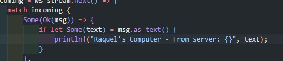

# Tutorial 10 - Broadcast Chat

#### Raquel Nayyara Aulia - 2206826583

## Original code, and how it run

Untuk menjalankan: Ketikkan perintah `cargo run --bin server` untuk mengaktifkan server. Ketikkan `cargo run --bin client` untuk memulai klien

Ketika klien mengirimkan pesan, server akan menerima pesan tersebut, menampilkannya di terminal server, dan kemudian menyiarkan pesan itu ke klien lain yang terhubung dengan server

## Modifying port

Untuk mengubah port klien, perlu dilakukan pengubahan pada metode `ClientBuilder::from_uri()`.

Untuk mengubah port server, perlu dilakukan pengubahan pada metode `TcpListener::bind()`.

## Small changes. Add some information to client

Perubahan pada `client.rs`

Saya hanya menambahkan text `Raquel's Computer`

Perubahan pada `server.rs`

Menambahkan client address pada pesan yang dikirim client